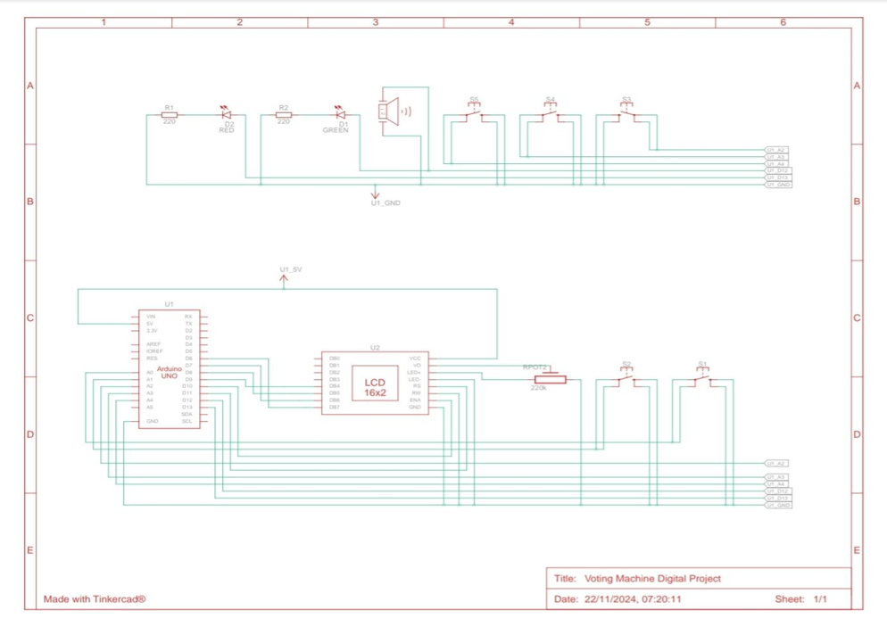
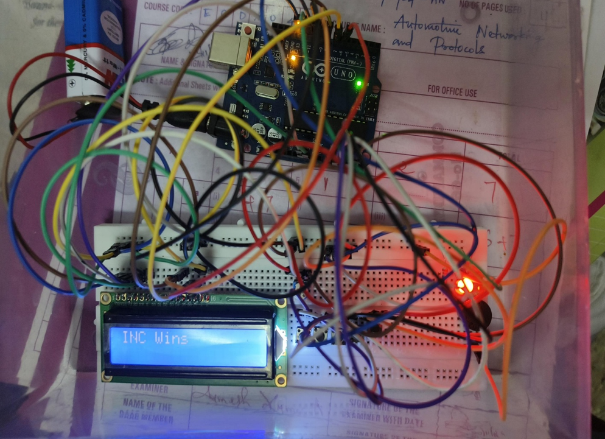
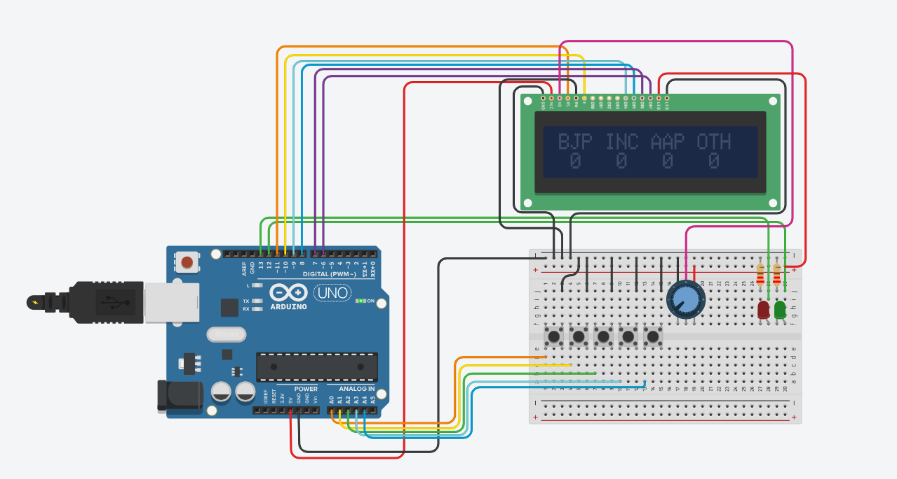
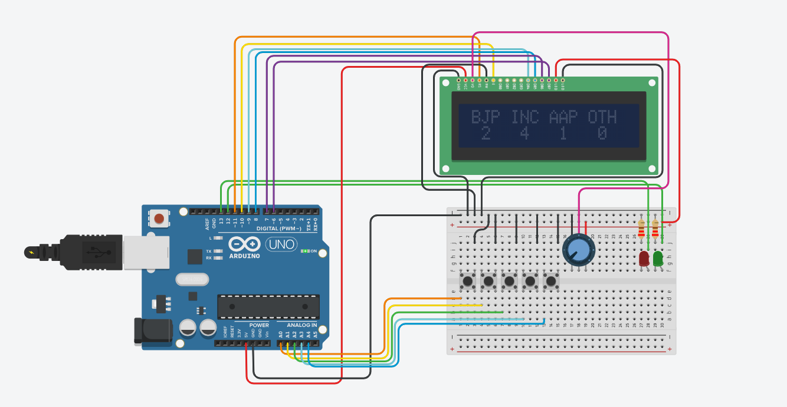
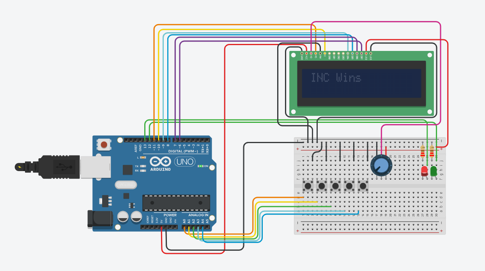

# Arduino Electronic Voting Machine

An Arduino-based electronic voting machine designed to record votes and display the voting results using an LCD.

## Project Overview

This project demonstrates the implementation of a basic electronic voting system using an Arduino microcontroller. The system allows users to cast votes through input buttons and displays the voting results on an LCD.

## Features

- Electronic vote casting using push buttons
- Vote counting using Arduino
- LCD-based display for user interaction and results
- Simple and easy-to-understand voting logic
- Real-time display of voting results

## Hardware Used

- Arduino Uno
- 16×2 LCD Display
- Push Buttons
- LEDs
- Resistors
- Potentiometer
- Buzzer
- Breadboard
- Connecting Wires

## Software and Tools

- Arduino IDE
- Embedded C / Arduino Programming
- Tinkercad Circuits

## Working

1. The system is powered on and initialized.
2. The LCD displays the available voting options.
3. The user selects an option using the corresponding button.
4. Arduino registers and counts the vote.
5. The updated voting information is displayed on the LCD.
6. The final voting result is displayed after the voting process.

## Circuit Diagram



## Hardware Setup



## Simulation

The circuit was simulated using Tinkercad Circuits to verify the working of the voting system.

### Initial State



### Voting Process



### Voting Result



## Technologies Used

- Arduino
- C/C++ (Arduino programming)
- Tinkercad Circuits
- LCD interfacing
- Digital input/output

## Project Documentation

The project report and implementation files are included in this repository.

[View Project Report](documentation/Arduino_Based_Electronic_Voting_Machine_Project_Report.pdf)

## Source Code

The Arduino source code is available in the `code` folder.

[View Arduino Source Code](code/Electronic_Voting_Machine.ino)

## References

- Arduino Documentation
- Tinkercad Circuits
- Arduino LiquidCrystal Library Documentation
- YouTube Tutorial: https://youtu.be/yeEX9Z7e64I

## Project Structure

```text
arduino-electronic-voting-machine/
│
├── README.md
│
├── code/
│   └── Electronic_Voting_Machine.ino
│
├── documentation/
│   └── Arduino_Based_Electronic_Voting_Machine_Project_Report.pdf
│
└── images/
    ├── circuit_diagram.png
    ├── hardware_setup.png
    ├── simulation_initial.png
    ├── simulation_voting.png
    └── simulation_result.png
```

## Author

**Mohammed Thoufeeq Ali**

Electronics and Communication Engineering

GitHub: MdThoufeeq
